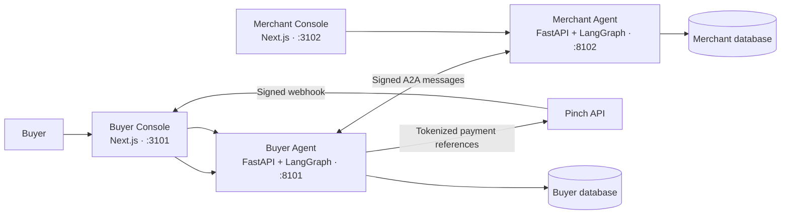

# Pinch Agent Payments

An agent-to-agent concert booking and payment system built on Pinch. A buyer agent discovers tickets, enforces a user-approved spending mandate, executes a tokenized Pinch payment, and reconciles the result with an independent merchant agent.

This repository is the public umbrella for four independently deployable services. They are linked as Git submodules so every service retains its own repository, CI workflow, version history, and deployment boundary.

## Architecture



## Services

| Service | Responsibility | Port |
| --- | --- | ---: |
| [pinch-buyer-agent](services/pinch-buyer-agent) | Mandates, buyer policy, merchant discovery, payment execution, webhook reconciliation | 8101 |
| [pinch-merchant-agent](services/pinch-merchant-agent) | Inventory, pricing, reservations, orders, and signed payment decisions | 8102 |
| [pinch-buyer-console](services/pinch-buyer-console) | Buyer setup, merchant discovery, mandate controls, and mission UI | 3101 |
| [pinch-merchant-console](services/pinch-merchant-console) | Seller onboarding, inventory, orders, and payment-event UI | 3102 |

The agents communicate over HTTP using signed A2A envelopes. Each agent owns its database; neither service writes directly into the other service's schema. Card numbers are never stored by this system—only Pinch payer and vaulted-source references are retained.

## Clone everything

```bash
git clone --recurse-submodules https://github.com/SacSresta/pinch-agent-payments.git
cd pinch-agent-payments
```

For an existing clone:

```bash
git submodule update --init --recursive
```

## Local startup

Each directory has its own README and `.env.example`. Copy examples locally; never commit populated `.env` files.

```bash
# Terminal 1
cd services/pinch-buyer-agent
uv sync --extra dev
cp .env.example .env
uv run python scripts/init_agent_db.py
uv run buyer-agent-dev

# Terminal 2
cd services/pinch-merchant-agent
uv sync --extra dev
cp .env.example .env
uv run python scripts/init_agent_db.py
uv run merchant-agent-dev

# Terminal 3
cd services/pinch-buyer-console
npm ci
cp .env.example .env.local
npm run dev

# Terminal 4
cd services/pinch-merchant-console
npm ci
cp .env.example .env.local
npm run dev
```

Configure Pinch's public webhook endpoint to the Buyer Console:

```text
https://<buyer-console-domain>/api/pinch/webhook
```

## Repository security

- Real credentials belong only in local `.env` files or encrypted deployment secrets.
- Public GitHub Actions run tests and builds without Pinch credentials.
- Do not put Pinch credentials, database passwords, webhook secrets, or A2A shared secrets in GitHub Variables.
- If deployment automation is added, use protected GitHub Environments and GitHub Actions Secrets.

## Development

Commit service changes in the service repository first, then update this umbrella repository's submodule pointer. See each service README for its API and test commands.
